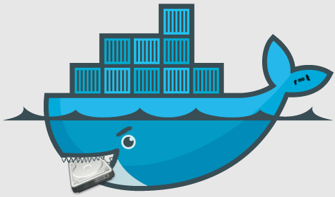

<p align="center">
   
</p>

In case of a container eating too much disk space, the following might help.

#### Log file location

The following command returns the path to the container log file.

```sh
docker inspect --format='{{.LogPath}}' <container_name_or_id>
```

#### Log file clearing

Combined with the following commands, the previous one helps in clearing the
log file.

```sh
echo "" > "$(docker inspect --format='{{.LogPath}}' <container_name_or_id>)"
```

Or.

```sh
truncate -s 0 "$(docker inspect --format='{{.LogPath}}' <container_name_or_id>)"
```

#### Mitigation

Directly modifying Docker's files is  not recommended since the external log
deletion could  happen while docker  is writing  `JSON` formatted data  to the
file, resulting in a partial line, and breaking the ability to read any logs
from the `docker logs` cli.

Instead, one  can have Docker  automatically rotate  the logs. This  is done
with  additional flags  to `dockerd`  if the  default [JSON  logging driver](https://docs.docker.com/config/containers/logging/json-file/)  is
used :

```sh
dockerd ... --log-opt max-size=10m --log-opt max-file=3
```

One can also set  this as part of the [daemon.json](https://docs.docker.com/engine/reference/commandline/dockerd/#on-linux)  file instead of modifying
the startup scripts :

```json
{
   "log-driver": "json-file",
      "log-opts": {
         "max-size": "10m",
         "max-file": "3"
      }
}
```
