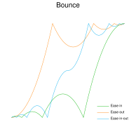

<h1 align="center">
   
</h1>

Easing functions denote mathematical formulas  that describe the rate at which
a numerical  value changes.  It may  be applied to  represent how  fast values
change  during animantions  which gives  the ability  to vary  the animation's
speed  over the  course of  its length.  It may  also be  used to  interpolate
between two colors in a color gradient.

<table border="0" align="center" cellspacing="5">
   <tr>
      <td></td>
      <td></td>
      <td></td>
   </tr>
   <tr>
      <td></td>
      <td></td>
      <td></td>
   </tr>
   <tr>
      <td></td>
      <td></td>
      <td></td>
   </tr>
   <tr>
      <td></td>
      <td></td>
      <td></td>
   </tr>
</table>

