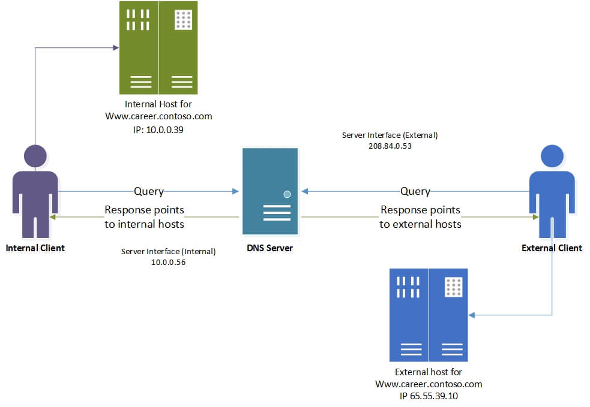

<p align="center">
   
</p>

<h1 align="center">DNS Database as a slave to Windows AD</h1>

Say you need to forward your network's DNS Queries someplace whether it be an
internal Windows AD server or another one at the other end of an IPSec VPN
tunnel. Worry not, your Fortigate is there to cover your rear.

It's recommended to follow using the CLI since a few options are not available
through the GUI; don't forget to enable the `DNS Database` if you're using the
latter.

First is to enable the DNS server on the Fortigate in `Recursive` mode:

```
# config system dns-server
# edit <interface-name>
# set mode recursive
# set dnsfilter-profile <profile-name> # This is optional
# next
# end
```

Next is to configure the split DNS:

```
# config system dns-database
# edit "<some-unique-name>"
# set domain "<the-domain-to-forward>"
# set type slave
# set ip-master "<the-ad-ip-address>"
# set forwarder "<the-ad-ip-address>"
# set source-ip "<the-listening-interface-ip>"
# next
# end
```

And that's about it, don't forget to edit your DHCP server settings to make
the Fortigate the primary DNS server.
