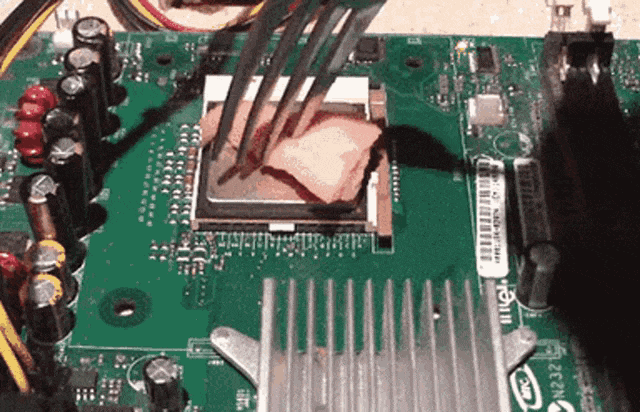

<p align="center">
   
</p>

<h1 align="center">Virtualized Windows CPU consumption</h1>

Even when idle, a Windows VM usually keeps the CPU as busy as if it's mining
Bitcoin. An easy fix is to :

```sh
❯ virsh edit <vm-name>
```

... and replace :

```xml
<clock offset='localtime'>
  <timer name='rtc' tickpolicy='catchup'/>
  <timer name='pit' tickpolicy='delay'/>
  <timer name='hpet' present='no'/>
  <timer name='hypervclock' present='yes'/>
</clock>
```

... with :

```xml
<clock offset='localtime'>
  <timer name='hpet' present='yes'/>
  <timer name='hypervclock' present='yes'/>
</clock>
```
