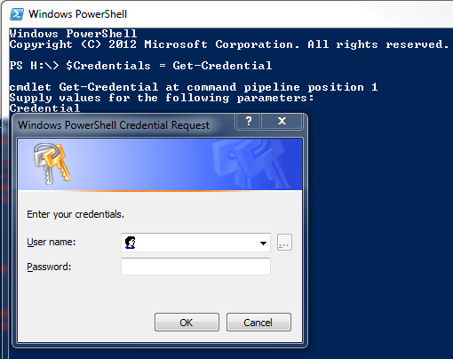

<p align="center">
   
</p>

### The ugly

Usually  when using  the `Get-Credential`  cmdlet, a  GUI dialog  box appears,
prompting for the  credentials. This is the *"Common  Criteria Certified"* way
of handling  credentials. It is  also a pain in  the ass at  times, especially
when  connecting using  one of  the different  command-line remote  management
utilities.  If the  necessary privileges  are provided,  this behavior  can be
altered to request the credentials via the command line.

```powershell
$RegistryKey = "HKLM:\SOFTWARE\Microsoft\PowerShell\1\ShellIds"
Set-ItemProperty $RegistryKey ConsolePrompting True
```

Once this  has been correctly  executed, `Get-Credential` will now  prompt for
the credentials directly on the command line.

***However, this “technique” is highly not recommended, avoid doing this.***

### The bad

There  *is* another  more  idiomatic  workaround to  prompt  for the  password
without  the  popping  window  using the  `-AsSecureString`  argument  of  the
`Read-Host` cmdlet. This  lets us stay in the powershell  prompt and fabricate
our credentials right then and there.

```powershell
$Username = 'example.org\example'
$Password = (Read-Host -AsSecureString)
$Credential = New-Object                                   `
   -TypeName     System.Management.Automation.PSCredential `
   -ArgumentList $Username, $Password
```

If you need to get the password  from somewhere else other than being inputted
interactively,  you can  use  the `ConvertTo-SecureString`  cmdlet instead  in
`line 2`.

This can easily be wrapped in a function like so :

```powershell
Function Get-Creds {
   [CmdletBinding()]

   Param (
      [Parameter(
            Position = 0,
         HelpMessage = 'Provide the username',
           Mandatory = $true
      )] [String] $Username,

      [Parameter(
            Position = 1,
         HelpMessage = 'Provide the password',
           Mandatory = $false
      )] [String] $Password
   )

   $Password = If ($Password -eq '') {
      Read-Host -AsSecureString
   } Else {
      ConvertTo-SecureString $Password -AsPlainText -Force
   }

   $Credential = New-Object                                   `
      -TypeName     System.Management.Automation.PSCredential `
      -ArgumentList $Username, $Password

   return $Credential
}
```

### The good

Simply use the `SecretManagement` and `SecretStore` modules.

```powershell
Install-Module Microsoft.PowerShell.SecretManagement, Microsoft.PowerShell.SecretStore
```

Register a `SecretStore` to store your passwords and credentials. We'll use
a local store to do that in this example since these can also be used with
[Azure Key Vault](https://docs.microsoft.com/en-us/azure/key-vault/general/overview?WT.mc_id=modinfra-16864-thmaure)
which is handy when working on multiple machines.

```powershell
Register-SecretVault -Name SecretStore -ModuleName Microsoft.PowerShell.SecretStore -DefaultVault
```

We can now store our credentials in the newly registered `SecretStore`.

```powershell
Set-Secret                    `
   -Name example              `
   -Secret 'v€r¥dumbp@$$w0rd' `
   -Metadata @{               `
      description = 'An example credential which can be later used in remoting and stuff.'`
   }
```

You   can  also   store   other   data  types   such   as  `PSCredential`   in
`SecretManagement`. For this  example, I used a basic `String`  since it works
for most scenarios.

PowerShell `SecretManagement` supports the following data types :

- `Byte[]`
- `String`
- `SecureString`
- `PSCredential`
- `HashTable`

We can start using the secret now :

```powershell
$TheSecret = Get-Secret -Vault SecretStore -Name example
$TheCred   = $Credential = New-Object                      `
   -TypeName     System.Management.Automation.PSCredential `
   -ArgumentList "example", $TheSecret
```

When using multiple  machines, keeping passwords and secrets in  sync can be a
pain, which is why we can use the Azure Key Vault extension.

```powershell
Install-Module Az.KeyVault
Register-SecretVault -Name AKV -Module Az.KeyVault -VaultParameters @{
   AZKVaultName = $vaultName
   SubscriptionId = $subscriptionId
}
```

You can now store and retrieve secrets  from the Azure Key Vault using `-Vault
AKV` instead of `-Vault SecretStore`.
